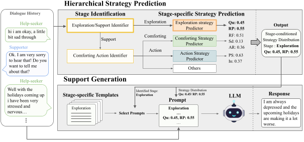

# Paper Code Release

Two independent components:
- `strategy_prediction/` — hierarchical strategy prediction on ESConv.
- `support_generation/` — vLLM-based support response generation conditioned on the strategy probabilities.

## Proposed Model




## 1. Strategy Prediction

Train and run cascade inference for `distilbert` / `roberta-base`:

```bash
bash strategy_prediction/scripts/run_all.sh --model distilbert --gpus 0
bash strategy_prediction/scripts/run_all.sh --model roberta-base --gpus 0
```

Train only or inference only:

```bash
bash strategy_prediction/scripts/train.sh --model distilbert --gpus 0
bash strategy_prediction/scripts/infer.sh --model distilbert --gpus 0
```

Outputs are written under `strategy_prediction/output/`.

## 2. Support Generation

Start a vLLM server and run inference, then aggregate metrics:

```bash
# vLLM serve + infer
bash support_generation/scripts/run_vllm.sh

# Eval only (after results exist)
bash support_generation/scripts/eval.sh

# End-to-end (serve + infer + eval)
bash support_generation/scripts/run_all.sh
```

Outputs are written under `support_generation/results/`.